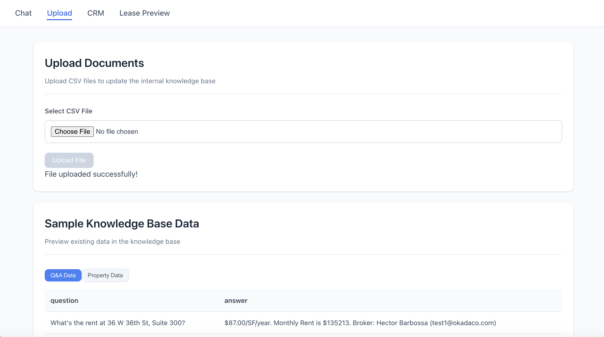
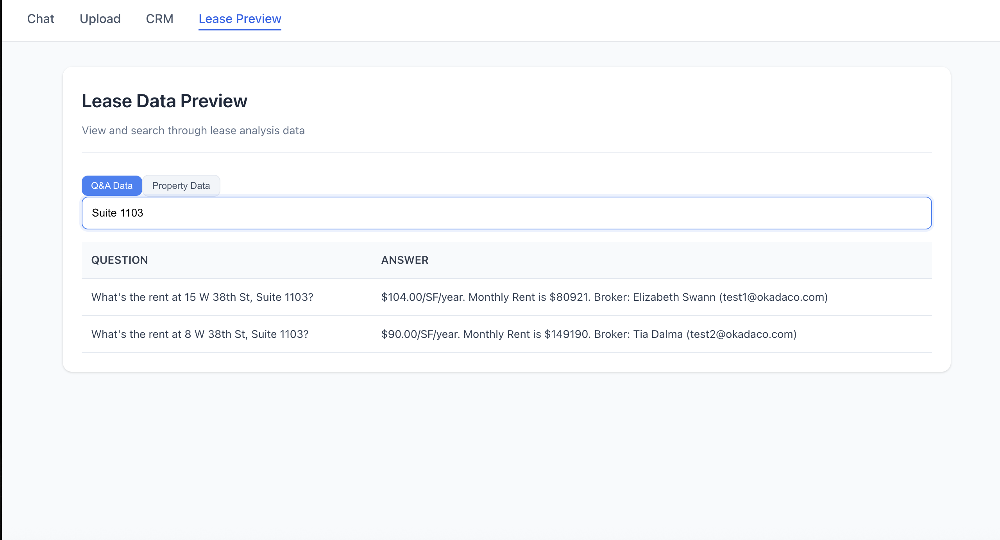
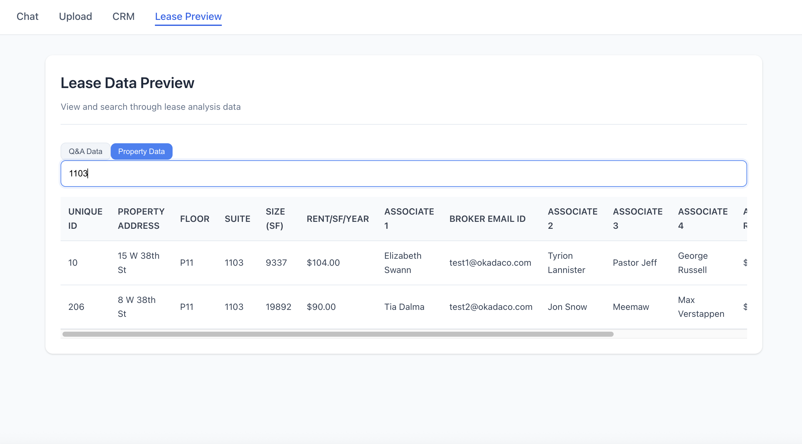
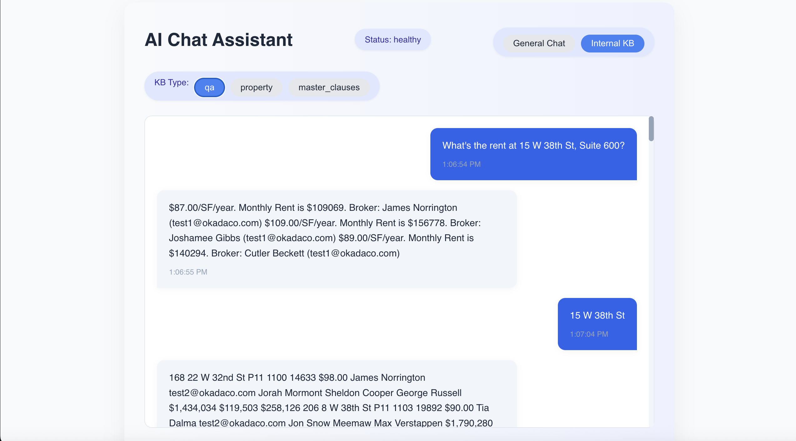
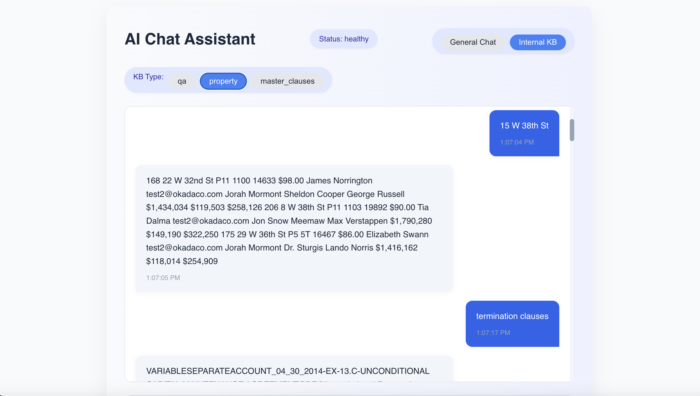
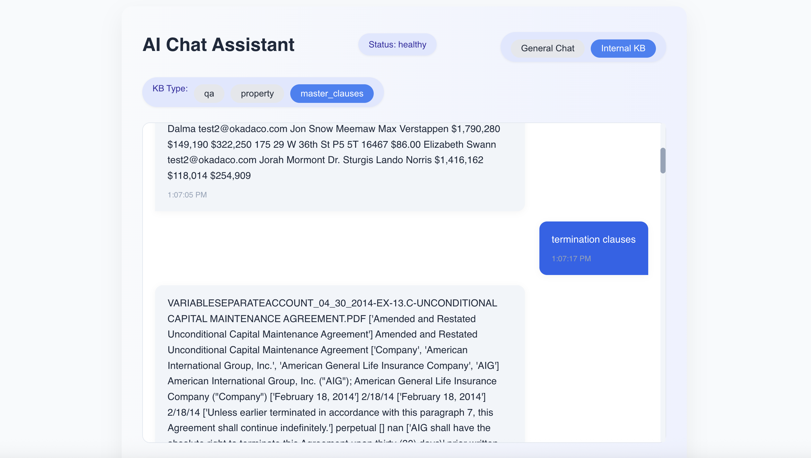
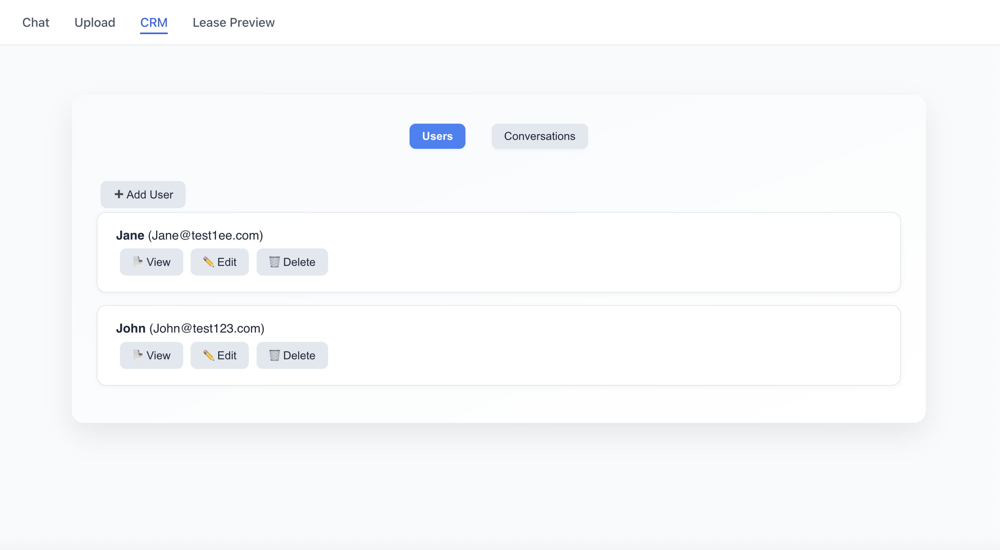
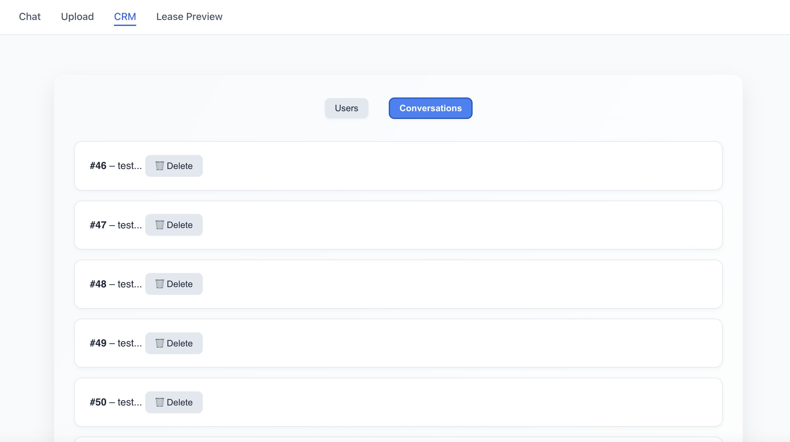

🧱 MultiAgent-Olair: Real-Time AI Agents for Lease & CRM Intelligence
MultiAgent-Olair is a full-stack platform combining a real-time lease analysis engine with internal CRM capabilities. It empowers commercial real estate professionals to upload, query, and analyze lease clauses and internal knowledge using AI agents powered by vector stores and OpenAI's GPT-3.5.
Caption: Screenshot of the MultiAgent-Olair dashboard showing lease preview and chat assistant.

🚀 Features

Supported Formats: Upload CSVs (qa, property, master_clauses) or PDF leases (WIP).
Real-Time Feedback: Instant success/failure notifications.
Storage: Files stored in /data/ directory.

🤖 AI Agents

Internal KB Agent: Searches across Q&A pairs, property data, and contract clauses using vector embeddings.
Lease Clause Agent: Performs risk and redline analysis on lease text.
Technology: Powered by OpenAI embeddings and GPT-3.5 for response synthesis.

📉 Lease Preview

View uploaded lease data (Q&A or Property) in a paginated, searchable table.
Toggle between data types seamlessly.

Caption: Lease preview table displaying property data with pagination and search.

📢 Chat Assistant

Conversational Interface: Ask natural language questions.
Modes:
General (auto vector search across all sources).
Internal KB only.

Sources: auto, internal, qa, property, master_clauses, lease.

👥 CRM Dashboard

User Management: Add, edit, or delete users.
Conversation Tracking: View user-specific or all conversation histories.
Assistant Replies: View or delete AI responses.

Caption: CRM dashboard showing user management and conversation history.

🛠️ Tech Stack
✨ Frontend (React - Create React App)

React 18
Axios (API requests)
Tailwind CSS + Custom CSS modules
React State Hooks & Conditional Rendering

🪡 Backend (FastAPI)

FastAPI
SQLAlchemy ORM + SQLite (or PostgreSQL for production)
Pydantic (data validation)
OpenAI API (GPT-3.5 for LLM inference)
FAISS-like vector store for embedding search
File handling for CSV/PDF ingestion

Caption: System architecture showing frontend-backend interaction and vector store integration.

📂 Project Structure
MultiAgent-Olair/
├── backend/
│   ├── app/
│   │   ├── __init__.py
│   │   ├── main.py
│   │   ├── agents/
│   │   │   ├── chat_agent.py
│   │   │   ├── internal_kb_agent.py
│   │   │   └── ...
│   │   ├── routes/
│   │   │   ├── chat.py
│   │   │   ├── crm.py
│   │   │   ├── upload.py
│   │   │   └── ...
│   │   ├── utils/
│   │   │   ├── embedding_utils.py
│   │   │   ├── file_utils.py
│   │   │   ├── retriever.py
│   │   │   └── ...
│   │   ├── crm/
│   │   │   ├── crud.py
│   │   │   ├── db.py
│   │   │   ├── models.py
│   │   │   └── schemas.py
│   │   └── data/
│   │       ├── qa_internal_kb.csv
│   │       ├── HackathonInternalKnowledgeBase.csv
│   │       ├── master_clauses.csv
│   │       └── ... (uploaded PDF files etc.)
│   ├── requirements.txt
│   ├── vercel.json
│   └── .env
├── frontend/
│   ├── public/
│   │   └── index.html
│   ├── src/
│   │   ├── api/
│   │   │   └── axiosconfig.ts
│   │   ├── components/
│   │   │   ├── ChatPage.tsx
│   │   │   ├── UploadPage.tsx
│   │   │   ├── LeasePreviewPage.tsx
│   │   │   ├── CRMPage.tsx
│   │   │   └── ...
│   │   ├── styles/
│   │   │   ├── ChatPage.css
│   │   │   ├── UploadPage.css
│   │   │   ├── CRMPage.css
│   │   │   ├── LeasePreviewPage.css
│   │   │   └── ...
│   │   ├── App.tsx
│   │   └── main.tsx
│   ├── package.json
│   ├── tsconfig.json
│   ├── vite.config.ts
│   ├── vercel.json
│   └── .env.local
├── images/
│   ├── multiagent-olair-overview.png
│   ├── lease-preview.png
│   ├── crm-dashboard.png
│   ├── architecture-diagram.png
│   └── ...
├── README.md
├── .gitignore
└── sample_data/
    ├── conversations.json
    └── users.json

🛠️ Setup Guide
1. Backend Setup (FastAPI)
cd backend
python -m venv venv
source venv/bin/activate  # or venv\Scripts\activate on Windows
pip install -r requirements.txt
uvicorn main:app --reload --port 8000

Base URL: http://localhost:8000
Environment Variables: Create a .env file:OPENAI_API_KEY=sk-xxxxx

2. Frontend Setup (React - CRA)
cd frontend
npm install
npm start

App URL: http://localhost:3000
Axios Config (src/api/axiosconfig.ts):import axios from "axios";

const api = axios.create({
  baseURL: "http://localhost:8000"
});

export default api;

🌐 API Endpoints
Chat Routes (/api/routes/chat)

POST / - General or internal chat queries.
POST /internal - Internal KB-enhanced chat.
POST /lease - Lease analysis questions.
POST /analyze-clause - Risk analysis for a single clause.
GET /health - System health check.
GET /sources - List available source types.
GET /kb-stats - Internal KB statistics.

CRM Routes (/api/routes/crm)

GET /users - List all users.
POST /users - Add a new user.
PUT /users/{id} - Update user details.
DELETE /users/{id} - Delete a user.
GET /users/{id}/conversations - View user conversation history.
GET /conversations - List all conversations.
POST /conversations - Add a new conversation.

Upload Routes (/api/routes/upload)

POST /docs - Upload CSVs (qa, property, clauses).
GET /internal-knowledge?type=qa|property - View uploaded data samples.

💡 Use Cases

Real Estate Teams: Query property details, e.g., "What is the annual rent for 123 Main St?"
Legal/Compliance: Analyze lease terms, e.g., "Show exclusivity or termination clauses."
Internal Teams: Access operational knowledge, e.g., "How do I submit a tenant repair request?"

🚫 Limitations

PDF ingestion not yet integrated with vector stores.
No user authentication (single user_id for now).
SQLite used for demo; switch to PostgreSQL for production.

🚀 Future Plans

 Full PDF parsing and vector store integration.
 Conversation logging for all AI agents.
 Admin dashboard for clause risk management.
 Tenant engagement bot with chat history.

📊 Sample Questions to Try

"What are the termination clauses?"
"What's the broker email for 456 Pine Ave?"
"How do I submit maintenance requests?"

📅 Developed for
Olair x AI Agents Hackathon

📊 CRM Schema Diagram

📝 Notes

Ensure the .gitignore file excludes sensitive files like .env and venv/.
For production, configure Vercel deployment settings in vercel.json for both frontend and backend.
Test API endpoints using tools like Postman or curl before integrating with the frontend.